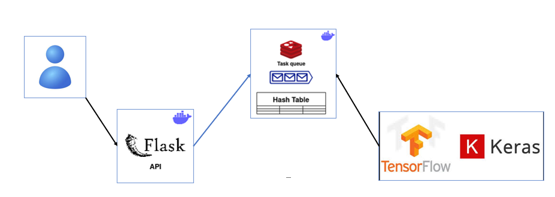

# SISTEMA DE RECOMENDACIÓN MODA

## Prueba para cargo de ML enginner.

### Candidato:

+ [Alejandro León Andrade]


# Resumen
Se desarrolló un sistema de recomendación híbrido para moda, combinando dos enfoques: uno basado en los embeddings de imágenes de productos y otro en el análisis de reseñas de usuarios. Para su implementación, se crearon dos modelos de recomendación, integrando características visuales y textuales para mejorar la precisión de las sugerencias.

Además, se diseñó una API en Flask que permite el consumo del modelo de recomendación, facilitando la consulta de un top N de productos personalizados para cada usuario. La infraestructura del proyecto se gestionó mediante Docker, asegurando portabilidad y escalabilidad. Se utilizaron diversas bibliotecas, entre ellas TensorFlow para el desarrollo del modelo, Scikit-learn para el preprocesamiento de datos y Flask para la creación de la API.

Este sistema proporciona recomendaciones al combinar múltiples fuentes de información, optimizando la experiencia del usuario en plataformas de moda.

 
# Arquitectura
Para permitir un desarrollo modular, escalabilidad y flexibilidad, se ha creado una arquitectura de microservicios con varios servicios en contenedores utilizando Docker y Docker Compose:
```
├── api -> Modulo que expone un api para generar recomendaciones. Desarrollado con python y flask.
├── model -> Contiene el modelo de recomendación híbrido que usa dos modelos uno basado en texto y otro en imágenes.
├── redis -> Se utiliza como un intermediario de mensajes; en su interior tiene una cola de tareas y una tabla hash.

```



# API
Se usa para exponer un servicio de recomendación donde dado un usuario, y un número (top), retorna recomendaciones de productos para ese usuario. Este api genera un elemento de llave-valor en REDIS que funciona como una cola. Cada petición guarda un id único y los datos de usuario y cantidad de recomendaciones deseada. Este componente escucha tambien desde la base de datos Redis, en espera de la respuesta a la petición del usuario. 

# Redis
Funciona como una cola de mensajes, que se guarda en la base de datos. Mantiene un id único y un diccionario con los datos de cada petición. Se usa este componente para mejorar la concurrencia en el sistema y evitar cuellos de botella.

# Modelo
Contiene la lógica del sistema de recomendación el cual es híbrido y se compone de :

1) Un modelo que convierte imágenes de producto en embeddings.
2) Un modelo que convierte los reviews de los clientes en embeddings.
3) Una red neuronal perceptron multicapa que realiza una regresión cuya variable de salida es el puntaje o score de un cliente hacia un producto.


# Instalación

Se construye una aplicación en docker la cual construye los contenedores necesarios para ejecutar toda la aplicación.
Con el fin que sea portable e instalable en cualquier máquina se debe ejecutar los siguientes comandos.

El proyecto se construye usando el siguiente comando en la carpeta raiz.
```
bash
$ docker-compose up -d
```

Cada vez que se haga un cambio se debe ejecutar:
```
bash
$ docker compose up --build
```

Para detener los servicios:
```
bash
$ docker-compose down
```

Para hacer uso del sistema de recomendación se puede hacer una petición get al servicio:
http://localhost:5000/recommendation

con parámetros de consulta customer_id y top

Por ejemplo.

http://localhost:5000/recommendation?customer_id=AGBQGWBWT3SXHTNFC2NCEU2W6HHA&top=3


## 📫 Contacto  
👤 **Alejandro Leon Andrade**  
✉️ [jalejandro.leon@outlook.com](mailto:jalejandro.leon@outlook.com)